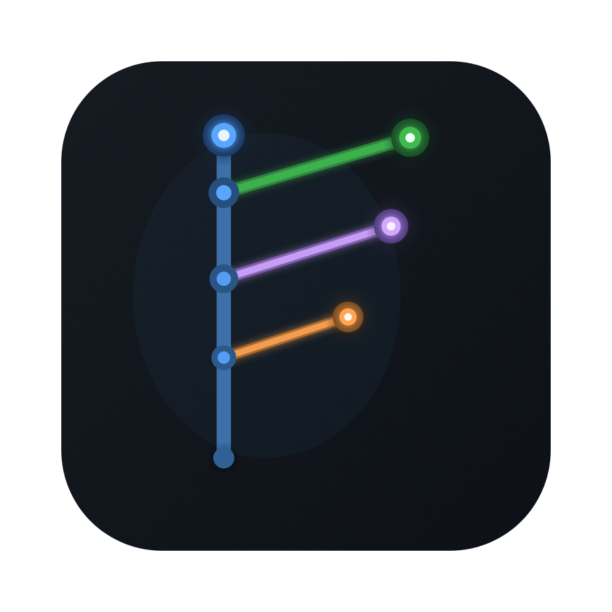

# GitWig

<p align="center">
  
</p>

<p align="center">
  살아있는 나뭇가지처럼 뻗어가는 커밋 그래프를 중심에 둔 Electron 기반 Git GUI 클라이언트
</p>

<p align="center">
  
  
  
  
  
</p>

GitWig은 Git 히스토리를 단순한 텍스트 로그가 아니라 "작업 흐름"으로 읽게 만드는 데 초점을 둔 데스크톱 Git 클라이언트입니다.  
브랜치 구조, 커밋 상세, staging, stash, conflict resolution, split diff, git activity log를 하나의 앱 안에서 이어서 처리할 수 있습니다.

## 핵심 기능

- 시각적 커밋 그래프
  브랜치 흐름, merge 지점, ref badge를 한 화면에서 읽을 수 있습니다.
- 브랜치 탐색과 조작
  checkout, rename, delete, merge, squash merge, pull, push를 사이드바 컨텍스트 메뉴에서 처리합니다.
- 커밋 상세 + diff
  파일 목록, 커밋 본문, 단일 diff, 별도 split diff 창을 지원합니다.
- staging workflow
  staged/unstaged 파일 관리, 파일 단위 stage/unstage, 자동 커밋 메시지 생성 기능을 제공합니다.
- stash 패널
  stash 목록 조회와 apply를 앱 내부에서 수행할 수 있습니다.
- conflict resolution
  충돌 파일이 감지되면 3패널 에디터 기반 해결 UI를 띄웁니다.
- 로그 필터
  `1st`, `Merge` 제외, 작성자, 날짜, 텍스트 검색으로 히스토리를 줄여 볼 수 있습니다.
- 테마와 설정
  dark/light/auto 테마, auto-fetch 주기, 앱 업데이트 상태를 설정 모달에서 관리합니다.
- Git activity console
  앱이 실행한 git 명령, 소요 시간, 실패 메시지를 세션 단위로 추적합니다.

## 현재 UI 포인트

- 새 앱 아이콘은 기존 git graph 모티프를 실제 가지와 잎이 있는 twig 형태로 재해석했습니다.
- branch list의 upstream 상태는 `pull / push` 개수를 직관적인 아이콘과 컬러로 표시합니다.
- staging 영역은 기본적으로 파일명만 보여주고, hover 시 상위 폴더 경로를 툴팁으로 노출합니다.
- split diff 창은 메인 앱의 현재 테마를 그대로 따라갑니다.

## 기술 스택

- React 19
- Electron 40
- TypeScript 5
- Zustand
- Tailwind CSS 4
- Styled Components
- simple-git
- Monaco Editor
- Vite
- electron-builder

## 프로젝트 구조

```text
.
├─ electron/                  # main/preload 및 git IPC
├─ src/
│  ├─ components/
│  │  ├─ CommitGraph/         # 메인 그래프와 히스토리 필터
│  │  ├─ CommitDetail/        # 커밋 상세, diff, split diff
│  │  ├─ StagingArea/         # staged / unstaged / commit
│  │  ├─ Sidebar/             # 프로젝트, 브랜치, stash
│  │  ├─ ConflictEditor/      # 충돌 해결 UI
│  │  └─ Common/              # 공통 모달, 타이틀바, 앱 아이콘
│  ├─ store/                  # 전역 상태와 git refresh 로직
│  └─ utils/                  # 그래프 레이아웃, 테마 계산 등
├─ build/                     # 앱 아이콘과 패키징 자산
└─ electron-builder.config.js
```

## 시작하기

### 요구 사항

- Node.js 18+
- npm
- Git
- macOS / Windows / Linux 중 하나

### 설치

```bash
git clone https://github.com/willofi/gitwig.git
cd gitwig
npm install
```

### 개발 실행

```bash
npm run dev
```

### 빌드

```bash
npm run build
```

현재 `build` 스크립트는 아래를 순서대로 수행합니다.

1. TypeScript 컴파일
2. Vite 렌더러 빌드
3. electron-builder 패키징

## 배포 메모

- GitHub Releases publish 설정이 이미 들어 있습니다.
- macOS에서 Gatekeeper 경고 없이 배포하려면 Apple Developer 기반 코드 서명과 공증이 별도로 필요합니다.
- 현재 저장소에는 macOS 아이콘 PNG/iconset 자산이 포함되어 있으며, 새 twig 아이콘 기준으로 갱신되어 있습니다.

## 개발 메모

- 로그 조회는 IPC를 병렬화해서 커밋을 먼저 보여주고, 상태/브랜치/stash는 뒤이어 갱신합니다.
- staging 패널의 add/reset는 전체 refresh 대신 `refreshStatus()`만 호출하도록 최적화되어 있습니다.
- split diff 창은 별도 window로 열리며, query parameter로 현재 테마를 전달받습니다.

## 로드맵 아이디어

- README용 실제 앱 스크린샷 정리
- macOS notarization 자동화
- Windows용 `icon.ico`도 새 twig 아이콘 기준으로 동기화

## 라이선스

ISC
